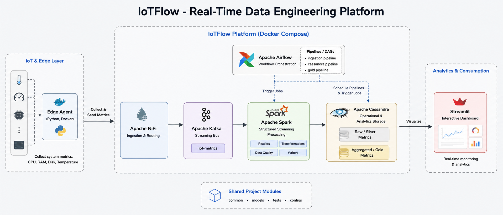

# IoTFlow — Real-Time Data Engineering Platform

IoTFlow is a real-time data engineering platform designed to collect, process, validate, store, and visualize IoT metrics.

## Architecture

```text
Edge Agent
    ↓
Apache NiFi
    ↓
Apache Kafka
    ↓
Apache Spark
    ↓
Apache Cassandra
    ↓
Streamlit
```

## Architecture Diagram




### Start all services

```bash
docker compose up -d
```

### Check running containers

```bash
docker compose ps
```

### Stop the platform

```bash
docker compose down
```

## Project Goal

The goal of IoTFlow is to demonstrate a complete real-time data engineering pipeline, from IoT data ingestion to data processing, validation, storage, orchestration, and visualization.
